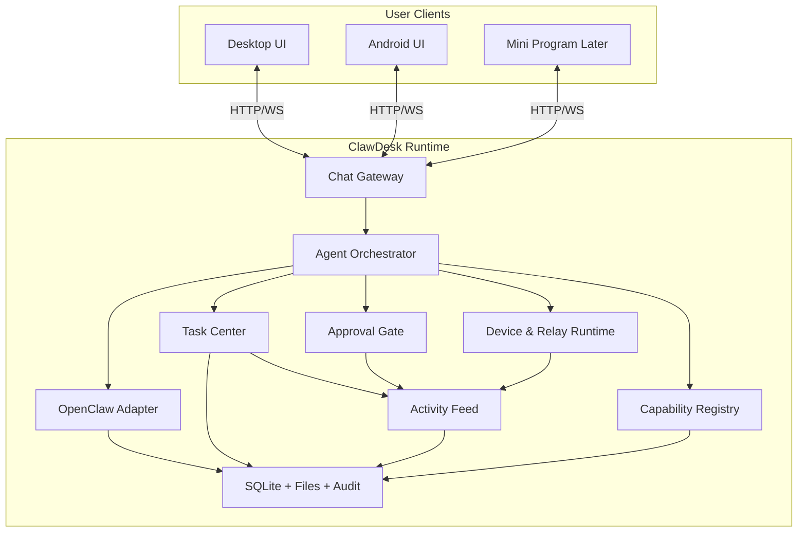

# ClawDesk 技术架构与目录结构草案（Agent 助手方向）

## 文档速览

这份文档专门说明：
- 项目早期技术架构草案
- 最初的目录结构与模块设想
- 作为历史参考保留的内容

最后更新：2026-03-12


## 1. 文档目标

这份文档用于把产品方向修正为“个人 Agent 助手”之后，重新定义技术落地边界。

重点回答：
- 对话式 Agent 如何成为一等公民
- 任务、活动流、能力目录如何组织
- 设备与 Relay 如何退到支撑层
- 桌面端和移动端如何共享同一套 Agent Runtime

## 2. 总体技术原则

### 2.1 原则一：Agent Runtime 是中心，设备监控是支撑

不再把系统监控视为产品中心。

新的中心应该是：
- 会话
- 任务
- 活动流
- 能力目录

设备指标、Relay、日志继续保留，但从主叙事中后移。

### 2.2 原则二：对话入口优先于控制面板入口

桌面端与移动端都要围绕聊天和任务展开。

### 2.3 原则三：能力透明

模型、技能、工具都要有统一注册表，供 UI 直接展示。

### 2.4 原则四：审批、审计、任务执行必须可追踪

Agent 更强，意味着：
- 每一步任务要可追踪
- 每个高风险动作要可审批
- 每次执行都要能解释

## 3. 总体架构



## 4. 核心模块边界

## 4.1 Chat Gateway

职责：
- 对话入口
- 会话管理
- 消息持久化
- 多端消息同步
- 对 Agent 请求进行标准化封装

核心输出：
- conversation
- message
- task intents
- current agent status

## 4.2 Agent Orchestrator

职责：
- 解析用户意图
- 选择模型
- 判断可用技能与工具
- 把自然语言请求转换为任务计划
- 触发审批与执行

这是新的核心运行模块。

## 4.3 Task Center

职责：
- 当前任务队列
- 定时任务与自动化
- 任务状态机
- 执行结果与失败原因

建议状态至少包括：
- `draft`
- `queued`
- `running`
- `waiting-approval`
- `blocked`
- `completed`
- `failed`
- `cancelled`

## 4.4 Activity Feed

职责：
- 面向用户的“Agent 在做什么”视图
- 记录任务步骤、审批、异常、关键事件

注意：
- 它不是原始日志
- 它是从任务执行和系统事件中提炼出来的用户可读活动流

## 4.5 Capability Registry

职责：
- 模型目录
- Skill 目录
- Tool 目录
- 可用性、授权状态、适用场景

用户必须能看到：
- 当前可用模型
- 当前可用 Skill
- 当前可用 Tool
- 哪些可用，哪些暂不可用，为什么

## 4.6 Approval Gate

职责：
- 高风险动作审批
- 审批结果写入
- 审批状态同步到任务和活动流

## 4.7 Device & Relay Runtime

职责：
- 系统状态采集
- Browser Relay host
- 设备配对与移动端状态支撑
- 日志与运行时健康检查

说明：
- 它仍重要
- 但它是 Agent 的执行环境，不应继续占据产品主视角

## 4.8 OpenClaw Adapter

职责：
- 兼容旧数据
- 复用模型、auth、relay、session、tasks 等既有能力
- 作为迁移层，而不是最终产品表达层

## 5. 数据模型建议

## 5.1 Conversation
- `conversation_id`
- `title`
- `source`（desktop / android / mini-program）
- `status`
- `created_at`
- `updated_at`

## 5.2 Message
- `message_id`
- `conversation_id`
- `role`（user / assistant / system / tool）
- `content`
- `model_id`
- `task_id`
- `created_at`

## 5.3 AgentTask
- `task_id`
- `source_type`（chat / schedule / manual）
- `summary`
- `status`
- `assigned_model_id`
- `required_skills`
- `required_tools`
- `approval_status`
- `result_summary`
- `error_summary`
- `created_at`
- `updated_at`

## 5.4 ActivityEntry
- `activity_id`
- `task_id`
- `kind`
- `title`
- `description`
- `severity`
- `created_at`

## 5.5 CapabilityItem
- `capability_id`
- `kind`（model / skill / tool）
- `display_name`
- `description`
- `enabled`
- `availability_status`
- `requires_approval`
- `meta_json`

## 6. API 分层建议

### 面向桌面和移动端的核心 Agent API
- `/api/v1/chat/*`
- `/api/v1/tasks/*`
- `/api/v1/activity/*`
- `/api/v1/capabilities/models`
- `/api/v1/capabilities/skills`
- `/api/v1/capabilities/tools`

### 支撑性 API
- `/api/v1/runtime/*`
- `/api/v1/devices/*`
- `/api/v1/browser/*`
- `/api/v1/logs/*`
- `/api/v1/mobile/*`

## 7. 仓库结构建议

当前 monorepo 可继续沿用，但建议逐步增加：

```text
clawdesk/
  apps/
    desktop/
  packages/
    shared-types/
    runtime-server/
    openclaw-core/
    agent-runtime/
    capability-registry/
    task-engine/
    activity-feed/
  mobile/
    android/
```

说明：
- `agent-runtime`：对话与任务编排核心
- `capability-registry`：模型/技能/工具目录
- `task-engine`：任务状态机与调度
- `activity-feed`：活动流聚合与用户可读解释

## 8. 桌面端页面结构建议

主导航建议调整为：
- Home
- Chat
- Tasks
- Activity
- Capabilities
- Devices
- Settings
- Logs

其中：
- `Chat / Tasks / Activity / Capabilities` 是主产品区
- `Devices / Logs / Settings` 是支撑区

## 9. Android 端页面结构建议

第一阶段建议：
- Home
- Chat
- Tasks
- Pairing
- Settings

第二阶段可增加：
- Alerts
- Capabilities

## 10. 一句话结论

技术架构的方向已经明确：

`ClawDesk 要从“监控 + 兼容层”升级为“以 Chat、Task、Activity、Capabilities 为核心的 Agent Runtime 产品”。`
